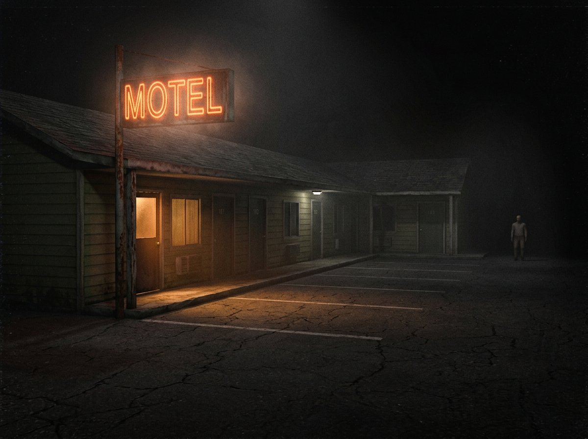

# 📼 STARVIEW — night shift at the Starview Motel

A complete, original, first-person psychological horror game in the spirit of
realistic low-fi story horror (think one ordinary job on one very wrong night).
Everything — story, characters, dialogue, motel, AI, sound — is original and
generated procedurally in the browser. **No build step, no CDN, no engine.**



## 🎮 Run it

Any static file server works (ES modules need `http://`, not `file://`):

```bash
python3 -m http.server 8000
# or: npx serve .
```

Then open `http://localhost:8000`. **Headphones strongly recommended.**

## 🌙 The pitch

WESTLAND COUNTY, ROUTE 9 — October. You're **Dana Reyes**, 19, covering a single
night shift (10:58 PM → morning) at her uncle Marco's fading roadside motel:
a ledger, three booked rooms, a list of chores, and a payphone that hasn't rung
in years.

The night starts as pure routine — sign in, flip the sign breaker, walk the row,
bring towels to the guest in Room 4, take the trash out — and then it starts
counting the *wrong* things. Stray texts. The office register. Doors that were
locked. A photo of the office window, taken from the parking lot, minutes ago.

It ends with a 50-amp fuse, a dead phone, and a sprint across the lot.

## ✨ Features

- **Full story campaign** across 5 chapters (~45–90 min), objective-driven,
  with an in-game clock, chapter cards, checkpoints and a chapter-select.
- **An original cast**: Dana (you, via phone/thoughts), uncle Marco & friends by
  text, the unsettling guest of Room 4… and *him*.
- **A fully diegetic smartphone**: iMessage-style threads with typing
  indicators, MMS photo scares, reply choices, a notes app for objectives,
  battery drain, flashlight toggle — and **NO SERVICE** when it matters most.
- **First-person body**: procedural hands that sway, breathe, reach and hold
  items; walk / run (stamina) / crouch; head-bob, camera lag and landing dip.
- **Interaction everywhere**: hinged doors (boltable), sliding drawers, light
  switches, blinds, a breaker panel with 5 live circuits, keys, the register,
  a ringable payphone, throwable physics objects (distraction tool!), and
  closets you can hide inside.
- **A human predator AI**: vision cones, hearing (running and thrown bottles
  give you away), investigation, searching, wall-sliding pursuit, door opening —
  and knocking when the door is locked. Hide in closets and under the counter…
  unless he *watched* you climb in.
- **Puzzle thread**: blown main fuse → register key → register drawer → spare
  fuse → main breaker, all while being hunted in the dark.
- **6 major scares + ambient dread**: the towel crack, the MMS photo, the CCTV
  grab, Room 4 found empty, the breaker-room ambush, and the driver's window.
- **Atmosphere engine**: PS2-grade low-fi pipeline (480p internal render,
  nearest-neighbour upscale, film grain, scanlines, heavy vignette, chroma
  impulses), procedural textures, fog, flickering fluorescents, a live CCTV
  feed, and a soundtrack that is *only* the night: wind, crickets, hum, and
  footsteps that are sometimes not yours. All audio is synthesized live with
  the Web Audio API — there are no sound files.
- **Menus & meta**: title menu (live 3D backdrop), pause, settings (volume,
  sensitivity, invert-Y, FOV, grain, brightness, subtitles), how-to-play,
  chapter select, save/continue via `localStorage`, death → retry checkpoint,
  and a typewriter epilogue with your run stats.

## ⌨ Controls

| Action | Input |
|---|---|
| Move | `WASD` / arrows |
| Look | mouse (click to capture) |
| Run | `Shift` *(makes noise)* |
| Crouch | `C` / `Ctrl` *(quiet)* |
| Interact | `E` |
| Throw held object | `G` |
| Smartphone | `T` / `Tab` |
| Phone light | `F` |
| Dialogue choice | `1` / `2` |
| Pause | `Esc` |

## 🗂 Project layout

```
neurio/
├── index.html            # shell, HUD, phone, menus
├── src/
│   ├── main.js           # boot + loop + state machine + input
│   ├── story.js          # the director: chapters, scares, texts, ending
│   ├── world.js          # motel construction, doors, colliders, triggers
│   ├── world2.js         # office/laundry/rooms/props + interactables
│   ├── player.js         # FPS controller, hands, items, hiding
│   ├── ai.js             # the stalker (senses/search/chase/doors) + Vale
│   ├── npc.js            # procedural low-poly humans + animation
│   ├── phone.js          # the smartphone (threads/tasks/flashlight)
│   ├── audio.js          # 100% procedural Web Audio sound engine
│   ├── effects.js        # low-res grain/vignette post pipeline
│   ├── textures.js       # canvas-painted PS1 textures & signage
│   ├── interact.js       # raycast interaction system
│   ├── ui.js             # menus/HUD/subtitles/notifications
│   ├── save.js           # localStorage checkpoints & settings
│   └── utils.js          # math, AABB collision/LOS, canvas helpers
├── assets/               # key art + MMS photo (only external art)
├── vendor/three.module.js# Three.js r170 (MIT)
└── archive/eiffel-tower/ # previous project in this repo (kept intact)
```

## 🔧 Notes

- Fictional story, fictional county. Any resemblance to real motels that count
  nine doors and light eight is… probably fine.
- Built with Three.js r170 (MIT © mrdoob and contributors).
- Works offline once served — everything else is generated at runtime.
