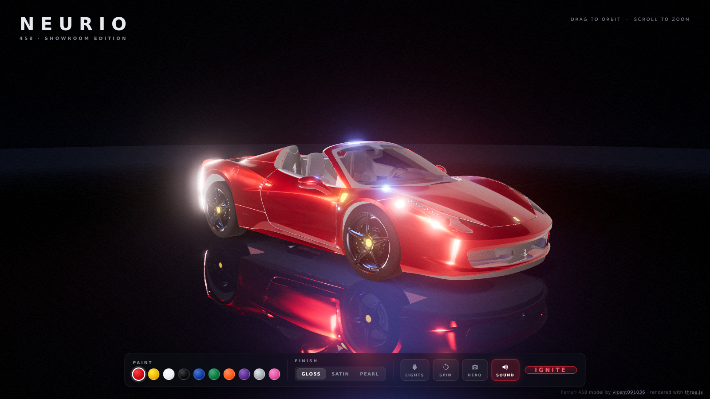
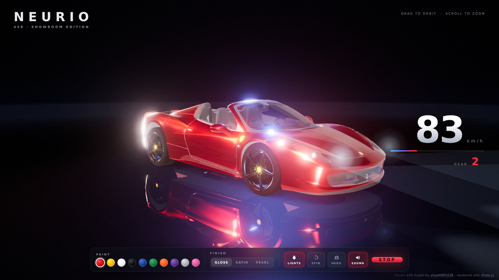

# NEURIO · 3D Hypercar Showroom

**An insanely realistic, fully interactive 3D car showroom in the browser** — built with Three.js, physically-based materials, a real-time mirror floor, HDR studio lighting, and a synthesized V8 you can ignite.



## ✨ Features

| | |
|---|---|
| 🏎️ **Real geometry** | Ferrari 458 Italia (Draco-compressed GLB) with 50+ parts — body, glass, carbon trim, brakes, full interior and steering wheel |
| 🎨 **10 paints × 3 finishes** | Rosso Corsa → Nero Daytona, in **Gloss / Satin / Pearl** (true iridescence) |
| 🪞 **Real-time mirror floor** | Planar reflector dimmed to polished concrete, with contact shadows and radial fade |
| 💡 **HDR studio lighting** | 1K studio HDRI through PMREM + colored rim rig, ACES tonemapping, soft shadows |
| 🔦 **Working headlights** | Emissive lenses + spotlight beams + volumetric cones + DRLs + taillight glow |
| 📷 **Cinematic camera** | HERO / FRONT / SIDE / REAR / TOP presets with eased transitions, damped orbit |
| 🚀 **IGNITE drive mode** | Spinning wheels, animated 6-speed gearbox HUD, scrolling speed grid, engine vibration, camera shake, FOV kick |
| 🔊 **Synthesized V8** | Pure WebAudio engine — dual saws + sub through a resonant, waveshaped filter (no audio files) |
| ✨ **Post-processing** | MSAA ×4, bloom, ACES output, vignette + film grain |



## 🎮 Controls

- **Drag** to orbit · **Scroll** to zoom
- **PAINT** swatches — live repaint of the body
- **FINISH** — `GLOSS` / `SATIN` / `PEARL`
- **LIGHTS** — headlights, beams & taillights
- **SPIN** — auto turntable
- **HERO** — cycles camera views
- **SOUND** — engine audio on/off
- **IGNITE / STOP** — launch mode: wheels, gearbox HUD, speed grid, full noise

## 🛠️ Tech

- [Three.js](https://threejs.org) r186 — `MeshPhysicalMaterial`, `PMREMGenerator`, `Reflector`, `UnrealBloomPass`, Draco GLTF
- [Vite](https://vite.dev) for dev server & builds
- WebAudio API for the engine synth — zero audio assets
- Fully static output → deploys to GitHub Pages

## 🧑‍💻 Development

```bash
npm install
npm run dev       # http://localhost:5173
npm run build     # static site in dist/
npm run preview   # serve the production build
```

Headless screenshot helpers (used to generate the images above):

```bash
node scripts/shot.mjs http://localhost:5173/ out.png "lights,ignite,wait4000"
```

## 🚀 Deployment

Push to `main` — the **Deploy to GitHub Pages** workflow builds and publishes automatically.
Live at: `https://zakariabouifri03-max.github.io/neurio/`

## 📄 Credits

- **Car model:** Ferrari 458 Italia by [vicent091036](https://sketchfab.com/models/57bf6cc56931426e87494f554df1dab6) (via the [three.js examples](https://github.com/mrdoob/three.js))
- **Environment map:** monochrome studio HDRI (Poly Haven, CC0) via three.js examples
- Rendered with [three.js](https://threejs.org) (MIT)

*Fan/project demo — not affiliated with Ferrari.*
