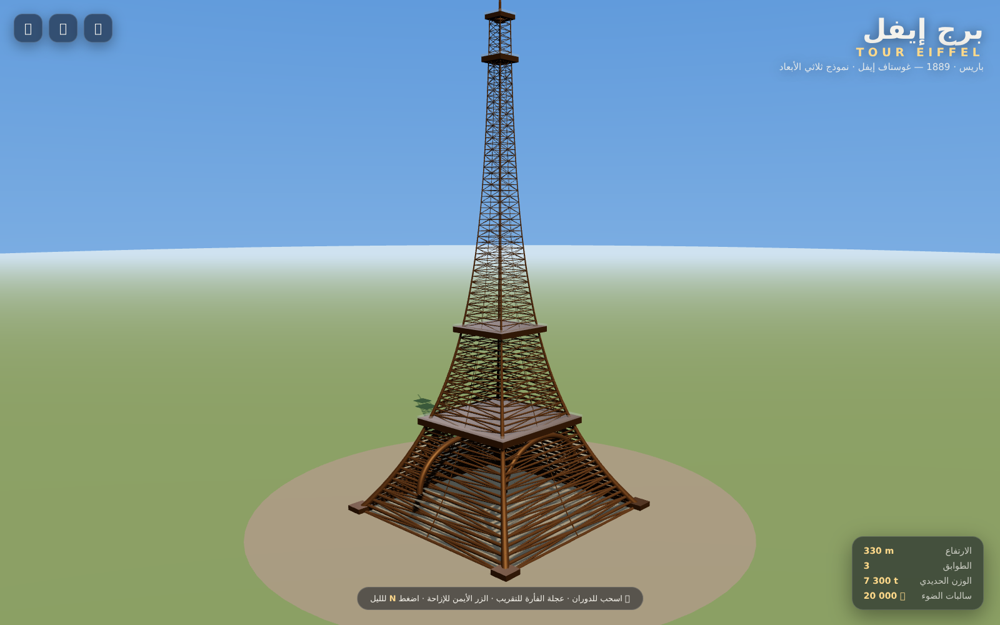
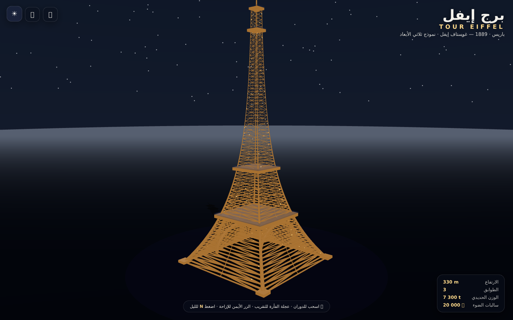

# 🗼 برج إيفل · Tour Eiffel 3D

نموذج تفاعلي ثلاثي الأبعاد لبرج إيفل مبني بالكامل بشكل إجرائي (procedural) باستخدام **Three.js** — بدون بناء (no build step) وبدون أي CDN خارجي.

> Interactive 3D model of the Eiffel Tower, fully procedural with Three.js. No build step, no external CDN — everything is vendored.





---

## ✨ المميزات · Features

- 🏗️ **هيكل شبكي إجرائي** — أكثر من 33,000 مثلث مبنية برمجيًا بأبعاد حقيقية:
  - القاعدة: 124.9 م · الطوابق: 57.6 / 115.7 / 276.1 م · قمة الهوائي: 330 م
- 🌙 **وضع ليلي / نهاري** — إضاءة ذهبية + محاكاة **20,000 وميض** (الزر أو حرف `N`)
- ⭐ سماء متدرجة مع نجوم متلألئة ومنارة حمراء وامضة (تحذير الطيران)
- 🎥 دوران تلقائي يتوقف عند التفاعل
- 🖱️ تحكم كامل: دوران / تقريب / إزاحة (OrbitControls)
- 🇲🇦 واجهة عربية RTL بتصميم زجاجي (glassmorphism)
- 📦 **صفر تبعيات وقت التشغيل** — three.js r170 مرفق داخل `vendor/`

## 🚀 التشغيل · Run

أي خادم ملفات ثابت يكفي:

```bash
python3 serve.py            # بلا كاش (مستحسن)
# أو
python3 -m http.server 3000
# أو
npx serve .
```

ثم افتح `http://localhost:3000`

## 🎮 التحكم · Controls

| الفعل | الأداة |
|---|---|
| الدوران | سحب بالزر الأيسر / إصبع |
| التقريب | عجلة الفأرة / قرصة |
| الإزاحة | الزر الأيمن |
| ليل / نهار | زر 🌙 أو حرف `N` |
| دوران تلقائي | زر ⏸ / ▶ |
| ملء الشاشة | زر ⛶ |

## 📁 البنية · Structure

```
neurio/
├── index.html                      # الواجهة
├── src/
│   ├── main.js                     # محرك المشهد + بناء البرج إجرائيًا
│   └── style.css                   # التنسيق (RTL + زجاجية)
├── vendor/                         # three.js r170 (مرفق — لا حاجة لإنترنت)
│   ├── three.module.js
│   ├── controls/OrbitControls.js
│   └── utils/BufferGeometryUtils.js
└── docs/                           # لقطات الشاشة
```

## 🧠 كيف يُبنى البرج؟

كل شيء مرسوم برمجيًا في `src/main.js`:

1. **منحنى جانبي** `w(y) = 3 + 59.5·e^(−y/78)` يحاكي الانفراج الأسطوري للبرج
2. **4 أعمدة** متقاربة على 41 مستوى + حلقات أفقية + مقطعيات X على كل وجه
3. **4 أقواس** شبه بيضاوية تحت الطابق الأول (تُصنع بأنابيب `TubeGeometry`)
4. **منصات** الطوابق الثلاثة + الهوائي وكبينة القمة
5. كل القضبان تُدمج في **شبكة واحدة** (`mergeGeometries`) للأداء

---

صُنع بـ ❤️ باستخدام [Three.js](https://threejs.org) r170 (MIT © mrdoob والمساهمون)

---

## 🏎️ سوق الطوموبيل · Drive the Ferrari (`car.html`)

عالم خاوي وفيراري 458 ثلاثية الأبعاد (الموديل جاي من [mrdoob/three.js](https://github.com/mrdoob/three.js/tree/r170/examples/models/gltf) على GitHub) — كتمشي بحال طوموبيل حقيقية:

- فيزياء: slip ديال الروايض، friction circle، نقل الوزن، بواط أوطوماتيك 6 فيتيسات + أريير، drag الهوا
- فرين اليد للدريفت، TC كيتطفى بـ `T`، آثار الروايض فالأرض، صوت موتور V8 مصنّع
- 4 كاميرات (`C`)، أزرار لمس للتيليفون

| زر | فعل |
|---|---|
| `W`/`↑` | أكسيليراتور |
| `S`/`↓` | فرين / أريير |
| `A` `D` / `←` `→` | الفولان |
| `Space` | فرين اليد |
| `C` / `R` / `H` / `T` | كاميرا / reset / كلاكسون / TC |
| `G` / `Q` / `E` | الكاراج / اللي قبل / اللي بعد |

### 🚗 الكاراج — 21 طوموبيل (`G`، `Q` / `E`)

من الضعيفة للأقوى: جرّافة → تراكتور → كاميو الزبل → بلاطو → كاميو → لپومپيي → ديليفري → فاركونيط → لانبيلانس → طاكسي → كارتينغ → سيدان → SUV → كارتينغ سبور → البوليس → SUV لوكس → هاتشباك → سيدان سبور → **فيراري 458** → فورمولا → **المستقبل** (420 km/h).

كل وحدة عندها الموتور ديالها (Nm، rpm، عدد الفيتيسات)، الوزن، الگريپ والـ downforce — الفيتيسات كتحسب أوطوماتيك من قطر الروايض والسرعة القصوى.

Models: Ferrari 458 by vicent091036 (CC-BY 4.0) via three.js examples · 20 vehicles from Kenney Car Kit (CC0) via [Arslan12216775/kenney_car-kit](https://github.com/Arslan12216775/kenney_car-kit).
