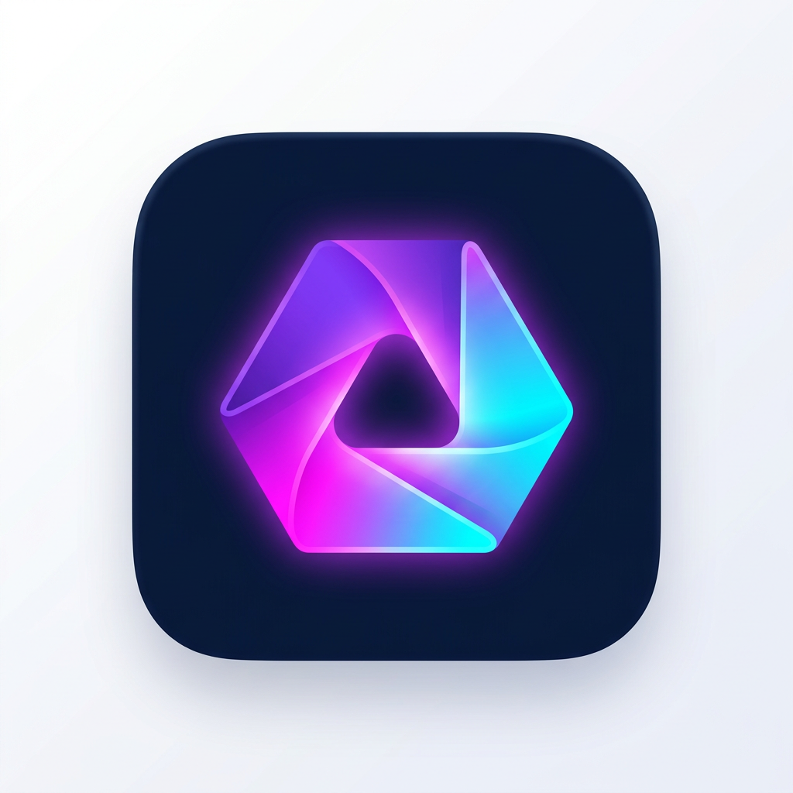

# Lumora Studio

**An original, offline-first AI graphic design editor for Windows.**
Electron + React + TypeScript + Fabric.js. No Canva code, assets, branding or templates are used — every template, icon, sticker and UI element in this repository was authored for this project.



---

## 1. What it does

Create YouTube thumbnails, Instagram posts, TikTok covers, posters, flyers, logos, t-shirt prints, social banners, presentations and fully custom sizes.

| Area | Capabilities |
| --- | --- |
| Canvas | Zoom, pan (Space + drag / middle-drag / Ctrl+wheel), grid, snap-to-grid, alignment guides, safe-area guides, transparent background, multi-page documents |
| Text | Headings / subheads / body / captions, font picker, **font upload (TTF/OTF/WOFF)**, bold, italic, underline, alignment, letter spacing, line height, curved text (text-on-path), outline, shadow, gradient fill, skew/warp, rotation, double-click-to-edit on canvas |
| Images | PNG / JPG / WEBP / GIF / SVG upload, drag-and-drop onto canvas, resize, crop, rotate, flip, brightness / contrast / saturation / blur, filter presets, shadows, masking into circle / rounded / triangle / star, **offline background removal**, **offline 2× upscaling** |
| Elements | Shapes, lines, arrows, icons, badges, frames, decorations, stickers, gradient fills — all original vector art |
| Layers | Select, rename, hide, lock, duplicate, delete, reorder, bring to front / send to back, groups (Ctrl+G / Ctrl+Shift+G) with nested display |
| Pages | Add, duplicate, delete, reorder, per-page sizes inside one project |
| Export | PNG, JPG, WEBP, PDF (multi-page), resolution scale, quality, transparency, page selection, quick presets (1080×1080, 1920×1080, 1080×1920, 1280×720, 4500×5400, custom) |
| Projects | Create, rename, save, open, duplicate, delete, debounced auto-save, import/export `.lumora.json` |
| AI | Design generator, image generator, background remover, upscaler, 10 copywriting tools — all behind a swappable provider layer |

### Offline-first

Everything except cloud AI works with no internet: canvas, text, shapes, layers, image editing, background removal (local algorithm), upscaling (local resampler), the offline design composer, saving/opening projects and exporting. The header shows **Offline Mode** or **AI Online** based on real connectivity.

---

## 2. Download the installer (no build needed)

**[⬇ Lumora-Studio-Setup-1.0.0.exe](https://github.com/zakariabouifri03-max/neurio/releases/download/v1.0.2-win/Lumora-Studio-Setup-1.0.0.exe)** · [all releases](https://github.com/zakariabouifri03-max/neurio/releases)

Built automatically on a Windows runner by [`.github/workflows/build-windows.yml`](../.github/workflows/build-windows.yml).
The installer is unsigned, so Windows SmartScreen shows "More info → Run anyway" on first launch.
Push a new `v*` tag (or run the workflow manually from the Actions tab) to publish a fresh build.

---

## 3. Quick start (development)

```bash
cd lumora
npm install
npm run dev      # builds the main process, starts Vite, launches Electron
```

Other scripts:

```bash
npm run build        # compile main process + bundle renderer
npm run start        # run the production bundle in Electron
npm run package      # build the Windows installer -> dist/Lumora-Studio-Setup-1.0.0.exe
npm run package:dir  # unpacked Windows build (faster, for smoke tests)
npm run typecheck    # strict TypeScript check of renderer + main
```

> **Network note:** `npm install` downloads the Electron binary from GitHub Releases, and `npm run package` downloads the NSIS/winCodeSign toolchain. Both need unrestricted internet access the first time. In a sandbox with blocked release hosts the renderer still builds and runs (`npm run dev:renderer`), but Electron itself cannot start.

### Building the `.exe`

Run on Windows (recommended) or on Linux/macOS with Wine installed:

```bash
npm run package
```

Output:

```
dist/
  Lumora-Studio-Setup-1.0.0.exe   <- NSIS installer (choose install dir, desktop shortcut)
  win-unpacked/                   <- portable build
```

Replace `build/icon.png` with a 256×256 `build/icon.ico` for a custom installer icon (electron-builder will use `icon.ico` automatically).

---

## 4. Configuring AI API keys

1. Launch the app → **Settings → AI Providers**.
2. Paste a key for OpenAI, Google AI, a custom OpenAI-compatible endpoint, and/or a background-removal service.
3. Choose which provider handles text, images, background removal and upscaling, and adjust base URLs / model names.

**No budget? Free routes that work out of the box**

* **Images:** Image provider → *Free community endpoint (no key, no account)*.
* **Text:** Google AI free tier (`gemini-2.0-flash`), Groq (`https://api.groq.com/openai/v1`), OpenRouter free models, or a fully local Ollama / LM Studio server via the custom OpenAI-compatible endpoint.
* **Background removal / upscaling:** local, offline, always free.

**Security model**

* Keys are written through `ipcRenderer.invoke` to the **main process only** and encrypted with the OS keychain via Electron `safeStorage` (`%APPDATA%/Lumora Studio/data/secrets.bin`).
* The renderer can only ask *whether* a key exists (`secrets:status` returns booleans). Key values are never sent back to the UI, never logged and never bundled in code.
* All provider HTTP calls happen in the main process, so keys never touch the browser context.

No key configured? The app stays useful: the **offline design composer** lays out real designs locally, and background removal / upscaling default to the local algorithms.

---

## 5. Keyboard shortcuts

| Action | Shortcut |
| --- | --- |
| Undo / Redo | `Ctrl+Z` / `Ctrl+Shift+Z` |
| Save | `Ctrl+S` |
| Copy / Paste | `Ctrl+C` / `Ctrl+V` |
| Duplicate | `Ctrl+D` |
| Delete selection | `Delete` |
| Select all | `Ctrl+A` |
| Group / Ungroup | `Ctrl+G` / `Ctrl+Shift+G` |
| Export | `Ctrl+E` |
| Preview | `Ctrl+P` |
| Zoom in / out / fit | `Ctrl+=` / `Ctrl+-` / `Ctrl+0` |
| Pan | `Space` + drag |
| Nudge | Arrow keys (`Shift` = 10 px) |

---

## 6. Project structure

```
lumora/
├─ electron/                 # main process (Node) — never exposed to the renderer
│  ├─ main.ts                # window lifecycle, native menu, security policy
│  ├─ preload.ts             # contextBridge API surface (the only renderer <-> main channel)
│  ├─ ipc/index.ts           # validated IPC handlers (projects, files, settings, secrets, AI)
│  ├─ shared/types.ts        # main/renderer contract
│  └─ services/
│     ├─ store.ts            # atomic JSON storage + safeStorage secret vault
│     ├─ projects.ts         # project & custom-template CRUD
│     ├─ settings.ts         # app settings
│     └─ ai/                 # AIService
│        ├─ index.ts         #  ├── guard() — AI never throws across IPC
│        ├─ TextGenerator.ts #  ├── TextGenerator
│        ├─ ImageGenerator.ts#  ├── ImageGenerator
│        ├─ BackgroundRemover.ts
│        ├─ DesignGenerator.ts  (model-driven + offline composer)
│        ├─ Upscaler.ts
│        └─ providers.ts     # keys, HTTP, typed AIError
└─ src/                      # renderer (React 19 + TypeScript, strict)
   ├─ editor/engine.ts       # EditorEngine — sole owner of the Fabric scene graph
   ├─ state/                 # zustand stores (app + editor)
   ├─ components/
   │  ├─ editor/             # TopBar, CanvasStage, RightPanel, LayersPanel, PagesBar, Export, Preview
   │  ├─ panels/             # Templates, Elements, Text, Uploads, AI, Backgrounds, Projects, Brand Kit
   │  └─ common/             # UI primitives + icon set
   ├─ screens/               # Home (first-run) and Settings
   ├─ lib/                   # bridge, exporter, imageOps, blueprint, seed, shortcuts
   ├─ data/                  # original templates + vector assets
   ├─ types/                 # shared TypeScript types
   └─ styles/global.css
```

### Storage format

Projects are atomic JSON documents (`write temp → fsync → rename`) in
`%APPDATA%/Lumora Studio/data/projects/<id>.lumora.json`, so they survive crashes and Windows restarts and can be copied or version-controlled.

> **Why not SQLite?** The workload is whole-document read/write, not relational querying. A native module (`better-sqlite3`) must be rebuilt per Electron ABI and is the most common cause of broken Windows packaging. The transactional JSON store gives the same durability with zero native dependencies. Swapping in SQLite later only requires replacing `electron/services/projects.ts` — nothing else imports storage directly.

---

## 7. Security

* `contextIsolation: true`, `nodeIntegration: false`, preload `contextBridge` only.
* No remote content: external links open in the system browser, in-app navigation is blocked, permission requests are denied.
* Imported images are validated by extension **and** magic bytes, with a 40 MB cap; fonts are capped at 20 MB.
* Project/template IDs are validated before touching the filesystem (no path traversal).
* Every IPC handler returns `{ ok, data|error }` — a failed operation shows a toast instead of crashing the app, and a React error boundary catches render failures.

---

## 8. First run

On first launch Lumora seeds **five original demo projects** (YouTube thumbnail, Halloween t-shirt, Instagram post, gig poster, business flyer) and shows a welcome dialog with **Create Blank Design / Choose Template / AI Generate**.

---

## 9. Licensing

MIT for the application code. All bundled templates, icons, stickers and artwork are original works created for Lumora Studio. Fonts referenced in the picker are the system fonts installed on the user's machine; uploaded fonts stay local to the user's session.
