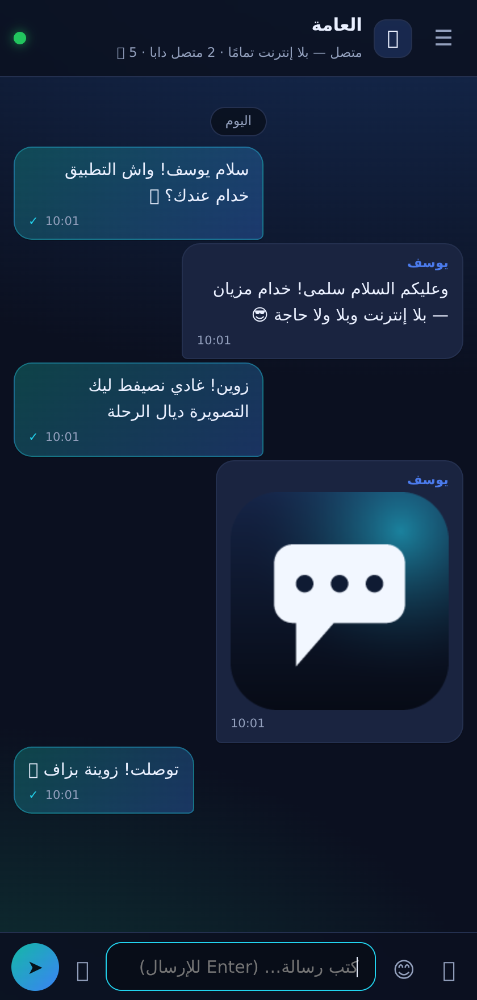
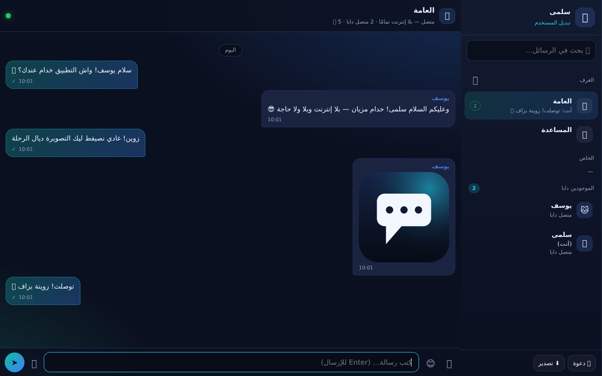
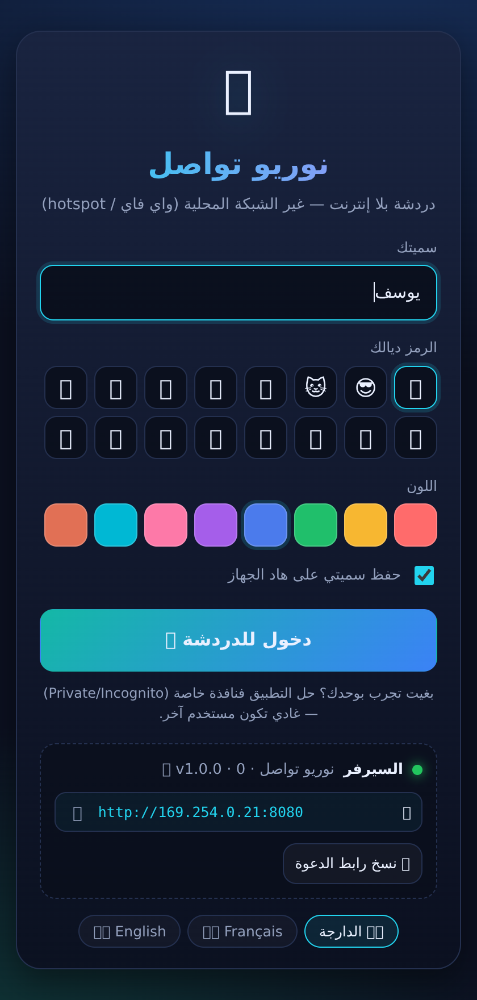

# 📡 نوريو تواصل — Neurio Offline Chat

**تطبيق تواصل كامل كيخدم بلا إنترنت — بلا سيرفر خارجي، بلا حساب، بلا مكتبات.**
A complete LAN messenger that works with **no internet at all**: no accounts, no
external server, no `npm install`. One file of Node.js (standard library only) plus
a small PWA — messages travel over your Wi-Fi router or a phone hotspot.

```
┌──────────┐        same Wi-Fi / hotspot         ┌──────────┐
│  📱 phone │◄────────────  no internet ─────────►│ 💻 laptop │
└────┬─────┘                                       └────┬─────┘
     │              ┌────────────────────┐              │
     └─────────────►│  node server.mjs   │◄─────────────┘
                    │  (your machine)    │
                    └────────────────────┘
```

<p align="center">
  
  
  
</p>

---

## ⚡ البدء السريع / Quick start

```bash
# 1. شغّل السيرفر (خاصك Node.js 18+ فقط — بلا npm install)
node tools/offline-chat/server.mjs

# غادي يطبع شي حاجة بحال:
#   💻  this machine   http://localhost:8080
#   📱  phones         http://192.168.1.7:8080
```

2. **الهواتف**: خلّيهم على نفس الواي فاي وحلو الرابط لي طلع فالتيرمينال.
   بلا واي فاي؟ فعّل **hotspot** من شي هاتف (بلا داتا) ودير الكونيكسيون منو.
3. كل واحد **«إضافة للشاشة الرئيسية»** — كتولي بحال تطبيق حقيقي، بأيقونة،
   وكتحل حتى ملي يقطع الواي فاي (الواجهة كتخزن فالكاش).

خيارات / options:

```bash
node tools/offline-chat/server.mjs --port 9000     # منفذ آخر
node tools/offline-chat/server.mjs --https         # شهادة ذاتية → الرسائل الصوتية 🎙️
node tools/offline-chat/server.mjs --name "دارنا"  # سمية السيرفر
node tools/offline-chat/server.mjs --data /tmp/chat # فين كيتسجل التاريخ
node tools/offline-chat/server.mjs --help
```

> 🎙️ **الرسائل الصوتية** (والميكرو عمومًا) كيحتاجو `https://` أو `localhost`.
> مع `--https` المتصفح غادي يعرض تحذير شهادة (شهادة ذاتية) → **Advanced / متقدم** →
> **Continue / كمّل**. باقي الخدمات (نص، صور، ملفات) كيخدمو بلا مشكل على `http`.


---

## 🌐 من GitHub مباشرة / Hosted straight from GitHub

عندك 3 طرق، من الأسهل للأقوى:

### أ) GitHub Pages — سيرفر ثابت (بلا سيرفر Node)
1. فالريبو: **Settings → Pages → Source: Deploy from a branch**
2. ختار الفرع (**main** ولا `arena/fd0733d4-neurio`) والمجلد **/ (root)** ثم **Save**
3. بعد شي دقيقة، الرابط كيولي:

   ```
   https://zakariabouifri03-max.github.io/neurio/tools/offline-chat/public/
   ```

فهاد الوضع ماكاينش سيرفر، والتطبيق كيدوز بوحدو لـ **وضع بلا سيرفر**:
* 🗂️ **نفس الجهاز**: حِل الرابط فتبويبين — كل تبويب مستخدم، والرسائل كيدوزو بيناتهم
  (BroadcastChannel). زيد الصور والملفات وصحابك الوهميين 😄
* 🔗 **جهازين**: ضغط على **«🔗 جهاز آخر (P2P)»** → أنشئ رمز الدعوة → صيفطو للجهاز الآخر
  بأي طريقة (واتساب، بلوتوث، نسخ يدوي) → هو كيرجع ليك رمز الجواب → اتصال مباشر
  (WebRTC بلا إنترنت، غير نفس الشبكة المحلية).

### ب) رابط فوري بلا إعداد (CDN كيقرا من GitHub)
```
https://cdn.jsdelivr.net/gh/zakariabouifri03-max/neurio@main/tools/offline-chat/public/
https://raw.githack.com/zakariabouifri03-max/neurio/main/tools/offline-chat/public/index.html
```
(نفس وضع «بلا سيرفر» فوق — زيد `?mode=local` إلا بغيت تفرضه.)

### ج) GitHub Codespaces — سيرفر حقيقي بضغطة واحدة ☁️
```
https://codespaces.new/zakariabouifri03-max/neurio
```
كيصنع ليك بيئة فيها Node، و**كيشغّل السيرفر أوتوماتيكيًا** على المنفذ 8080
(شوف `.devcontainer/devcontainer.json`). من بعد:
**Ports ▸ 8080 ▸ Port Visibility: Public ▸ Copy address** → الرابط كيخدم من أي هاتف
فالعالم، وكل الأجهزة كتولي متصلة بنفس السيرفر (مع الغرف، الخاص، الرفع…).

> ⚠️ Codespaces كيحتاج إنترنت (وهو سيرفر سحابي) — للإستعمال **بلا إنترنت** بحال ما كتبنا
> فوق، شغّل `node tools/offline-chat/server.mjs` على حاسوب فالشبكة المحلية.

### د) 📲 التطبيق (APK) — تنزلو مباشرة من GitHub وتثبتو فالتيليفون

`NurioTawasol.apk` (102 KB، موقّع v1+v2، أيقونة وسمية «نوريو تواصل») فيه التطبيق كامل
**داخل** التطبيق — كيتقرا بلا إنترنت وكيخدم حتى إلا ما كانش سيرفر.

```
https://github.com/zakariabouifri03-max/neurio/blob/main/NurioTawasol.apk            ← صفحة فيها زر Download
https://raw.githubusercontent.com/zakariabouifri03-max/neurio/main/NurioTawasol.apk   ← تحميل مباشر
https://cdn.jsdelivr.net/gh/zakariabouifri03-max/neurio@main/NurioTawasol.apk        ← CDN
```

> قبل ما يتدمج PR: بدّل `main` بـ `arena/fd0733d4-neurio` فالروابط فوق.

**التثبيت:** حِل الرابط فالتيليفون → نزّل الملف → دوس عليه → إلا طلب منك، شعل
«تثبيت التطبيقات من مصادر غير معروفة» للمتصفح/تطبيق الملفات → **Install**.
(إلا خرج تحذير Play Protect — عادي: التطبيق موقّع بمفتاح ذاتي ديالنا، ماشي من Play Store.)

**شنو كيخدم فيه:**
* ✅ الدردشة، الغرف، الرسائل الخاصة، التاريخ (كلشي محلي فالتيليفون)
* ✅ **بلا إنترنت**: على نفس الويفي/الهوتسبوت، وحتى P2P مباشر بين زوج تيليفونات
* ⚠️ الصور/الملفات والملاحظات الصوتية ما كايناش فالتطبيق (الـ WebView ما فيهش
  file chooser ولا صلاحية الميكرو) — التطبيق كيقول ليك هادشي فالتلميح، ودوس على
  «🔗 دعوة» باش تنسخ الرابط وتحلو فـ **Chrome** إلا بغيتيهم.

**كيفاش تصنعو بنفسك** (بلا Java، بلا Gradle — Python + openssl فقط):

```bash
node tools/offline-chat/build-singlefile.mjs      # التطبيق فملف واحد
python3 tools/offline-chat/apk/build_apk.py       # → NurioTawasol.apk
```

التفاصيل التقنية (AXML، dex، resources.arsc، التوقيع v1/v2، التحقق) فـ
[`apk/README.md`](apk/README.md).

---

## ✨ شنو كاين فيه / Features

| | |
|---|---|
| 💬 **دردشة فورية** | WebSocket مكتوب من الصفر — الرسالة كتوصل فورًا للجميع |
| 🏠 **غرف ومجموعات** | غرف عامة (العامة، المساعدة) + صدر غرف جديدة بضغطة |
| ✉️ **رسائل خاصة** | اضغط على أي واحد فقائمة الموجودين → محادثة ثنائية محمية |
| 🖼️ **صور وملفات** | إرسال حتى **25 ميغا**، معاينة الصور، تحميل الملفات (drag & drop و paste) |
| 🎙️ **رسائل صوتية** | تسجيل وإرسال مباشر (كيتحتاج `--https`) |
| ↩️ **رد · تنسيخ · حذف** | ردّ مع اقتباس، نسخ، وحذف الرسائل ديالك |
| 🔍 **بحث** | بحث فوري فكل رسائل الغرفة |
| 👥 **الموجودين دابا** | لائحة الأونلاين مع عدد الديفايسات لكل واحد |
| ✍️ **"كيكتب…"** | مؤشر الكتابة المباشر |
| 🔔 **تنبيهات** | جرس + إشعارات النظام ملي تكون الواجهة مسدودة |
| 🔌 **كيخدم بلا ولا شي** | الواجهة (PWA) محفوظة فالكاش، والرسائل كيتسناو فالطابور حتى يرجع السيرفر |
| 🌐 **WebSocket + HTTP** | إلا كان الپروكسي كيحجب الـ WebSocket، التطبيق كيدوز بوحدو لنمط Long-polling ويبقى خدام |
| 📄 **بلا سيرفر (GitHub Pages)** | حِل الرابط من GitHub: كل تبويب كيولي مستخدم — غادي تلقى راسك كتهدر بين تبويبين |
| 🔗 **P2P مباشر** | تربط جوج أجهزة فنفس الشبكة بلا سيرفر (WebRTC): رمز كيدوز بأي طريقة (واتساب/بلوتوث/نسخ) |
| 💾 **تاريخ محفوظ** | كلشي كيتسجل فـ `.data/store.json` — كيرجع من بعد الريستار |
| 🌍 **3 لغات** | الدارجة المغربية، Français، English (+ RTL/LTR) |
| 🧪 **مختبَر** | `test.mjs` (29 اختبار بروتوكول) — بلا أي مكتبة خارجية |

---

## 🔐 الخصوصية / Privacy

* كلشي **كيبقى فالدار**: السيرفر هو الجهاز ديالك، والرسائل ما كيخرجو مالشبكة المحلية.
* **بلا إنترنت**: ماكاين حتى اتصال للبرا — لا CDN، لا خطوط ويب، لا تحليلات.
* **بلا حساب**: سميتك غير محفوظة فالمتصفح ديالك (localStorage).
* الملفات المرفوعة كيتحيدو أوتوماتيكيًا من بعد **45 يوم**، والتاريخ كيحتفظ بآخر
  **300 رسالة** لكل غرفة.
* السيرفر **بلا كلمة سر** — أي واحد فالشبكة المحلية يقدر يدخل. للإستعمال الحساس،
  حدّد `--host 127.0.0.1` (جهاز واحد) أو استعمل شبكة موثوقة.

---

## 📂 الملفات / Layout

```
tools/offline-chat/
├── server.mjs              # السيرفر: HTTP + WebSocket (RFC 6455) + ملفات + API
├── make-icons.mjs          # كيصنع الأيقونات (PNG مكتوب باليد: zlib + CRC32)
├── test.mjs                # اختبارات كاملة للسيرفر والبروتوكول
├── public/
│   ├── index.html          # الواجهة
│   ├── style.css           # التصميم (RTL أولًا، دارك، موبايل-فيرست)
│   ├── app.js              # منطق التطبيق + وضع بلا سيرفر (تبويبات) + P2P (WebRTC)
│   ├── sw.js               # service worker — الواجهة كتخدم أوفلاين
│   ├── manifest.webmanifest
│   └── icon-*.png
└── .data/                  # (كيتصنع بوحدو، ما كيتزفّطش لڭيت)
    ├── store.json          # الغرف + الرسائل
    ├── files/              # المرفوعات
    └── tls/                # الشهادة الذاتية (مع --https)
```

---

## 🧪 الاختبارات / Tests

```bash
node tools/offline-chat/test.mjs     # 36 اختبار: HTTP، بروتوكول، ملفات، polling، تاريخ…
node tools/offline-chat/make-icons.mjs
```

بلا تبعيات وبلا إنترنت — كيشغّل السيرفر الحقيقي على منفذ عشوائي وفمجلد بيانات مؤقت،
وكيدير **جوج كليان WebSocket حقيقيين** وكيختبر كلشي من الأول للآخر.

زيادة على هادشي، التطبيق مختبَر فمتصفح حقيقي (Chromium headless) فـ **105 فحص**:
واجهة الاستعمال، الرد والاقتباس، الغرف، الخاص، الصور، الرسائل الصوتية، قطع الشبكة
وإرجاعها، الـ HTTP fallback، وضع `--https`/`wss`، والتعميل بلا سيرفر (تبويبات + P2P).

الاختبار كيشغّل السيرفر على منفذ مؤقت وكيدير جوج كليان حقيقيين (WebSocket) —
كيختبر الإرسال، الغرف، الخاص، الرفع، الحذف، الاستمرارية… وكينقّي مورا راسو.

---

## 🔌 API

| الطريق | الوصف |
|---|---|
| `GET /api/health` | حالة السيرفر + عناوين الـ LAN + عدد الأونلاين |
| `POST /api/upload` | رفع ملف (هيدرات: `x-file-name`, `x-file-type`) — الحد 25 ميغا |
| `GET /api/file/:id` | تنزيل/عرض ملف مرفوع |
| `GET /api/export?room=<id>` | تحميل المحادثة بحال نص `.txt` |
| `GET /ws` | WebSocket — بروتوكول JSON صغير (تحت) |
| `POST /api/poll/in` · `GET /api/poll/out` | نقل بديل (Long-polling) ملي الـ WebSocket محجوب |

**البروتوكول** (رسائل JSON، `t` = النوع):

* من الكليان: `hello` · `msg` · `typing` · `open` · `room` · `dm` · `delete` · `rooms` · `ping`
* من السيرفر: `welcome` · `msg` · `history` · `peers` · `rooms` · `dms` · `typing` · `delete` · `pong`

---

## 🛠️ مشاكل شائعة / Troubleshooting

| المشكل | الحل |
|---|---|
| الهاتف ما كيحلش الصفحة | تأكد أن الجهاز والهاتف فنفس الشبكة، وسمح للمنفذ 8080 فالـ firewall |
| `EADDRINUSE` | المنفذ مستعمل → `--port 8081` |
| المتصفح كيقول «الشهادة ماشي آمنة» | عادي مع `--https`، دير *Advanced → Continue* |
| الميكرو ماشي متاح | استعمل `--https`، ولا حِل الواجهة من `localhost` |
| بغيت نجرب بوحدي | حِل التطبيق **فنافذة خاصة** (Private) — كتولي مستخدم آخر |
| الپروكسي كيحجب الـ WebSocket | ما كاين مشكل — التطبيق كيدوز بوحدو لـ `?transport=poll` (HTTP) |
| بغيت نمسح التاريخ كامل | وقف السيرفر وحيّد مجلد `.data/` |
| حليت الرابط من GitHub وما كاينش سيرفر | عادي — التطبيق كيدوز لـ «وضع بلا سيرفر»: تبويبين فنفس الجهاز، ولا P2P بين جوج أجهزة |
| الـ P2P ما بغاش يتصل | تأكد أن الجوج أجهزة على **نفس الشبكة** (بلا إنترنت)، وأنك لصقت الرمز كامل |

---

## 📜 تقنيًا / Under the hood

* **صفر تبعيات**: `node:http`, `node:crypto`, `node:zlib`… كلشي من Node القياسي.
* **WebSocket مكتوب باليد**: مصافحة RFC 6455، تفكيك الفريمات، mask، ping/pong،
  تجميع الفريمات المقطوعة (continuation).
* **متين**: keep-alive كل 30 ثانية، إعادة اتصال تلقائية بتراجع أُسّي، طابور رسائل
  فالمتصفح كيتصيفط ملي ترجع الشبكة، تخزين ذرّي (write + rename) مع debounce.
* **جوج طريقان للنقل**: WebSocket (RFC 6455 مكتوب باليد) + Long-polling HTTP بنفس
  البروتوكول، مع تبديل أوتوماتيكي إلا فشلت المصافحة.
* **الأيقونات مولّدة بالكود**: PNG مكتوب يدويًا (IHDR/IDAT/IEND + zlib + CRC32)
  برسم رياضي للوگو — **بلا أي مكتبة صور**.
* **الواجهة**: HTML/CSS/JS خالص، RTL-first، موبايل-فيرست، PWA installable،
  بلا خطوط خارجية وبلا frameworks.

---

<div align="center">

صُنع بحال باقي المشروع: **كلشي من الكود، بلا ولا تبعية.** 🧰

</div>
